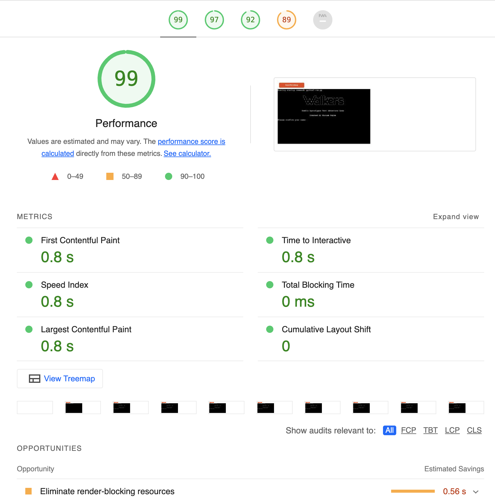

# WALKERS

This is a Python-based text adventure game where the user will have to survive the zombie apocalypse (progression to certain levels is age dependent). For the user to 'win' the game they must seek a high score as with progression to following chapters. 

[Live link to deployed version.](https://walkers-text-adventure.herokuapp.com/)

# UX

The game is deployed on Heroku and is strictly terminal-based for user interaction.

## Strategy 

Walkers is an interactive game focusing on users' interactions with the enemy and optional weaponry and how their choices will determine the path they choose. 

## Vision

The idea for this project came about from watching Shaun of the Dead film that had reminded me of the Walking Dead game by Telltale which I really enjoyed playing where the user is given choices and the outcome is dependant on said choices. The name of the app was inspired by Game of Thrones "White Walkers". I have tried to cater for age range and created multiple paths with progression chapters integrating into one another to encourage user retries. 

To help develop the initial concept, I created a flowchart using a tool called [Lucid Chart](https://lucid.app/lucidchart/b872e78e-dd5b-4e63-9880-363fe1e45396/edit?viewport_loc=-42%2C701%2C2116%2C1188%2C0_0&invitationId=inv_97bd3c42-a1f9-4322-8abe-2a64e014c959)

Once I had a basic understanding of what my story was going to be about and it’s outline on the flowchart, I started writing the code for the first chapter. Once I had finished with the chapters I proceeded to check how the code could be refactored for a better UX. This will not only increase the length of time the users will spend on one run-through but encourage them to replay the game and see what other routes will lead them into. The better the UX, the more complex the code.

### Main Goal

1. Create a text adventure game using Python.

2. For those using the app to have a pleasant user experience with incentive to return.

3. For the game to be enjoyable and allow users to win, offering retries

4. Allow the game to be a bit more personal to each individual by allowing them to state their name and age

5. Utilise the popularity of Zombies and make it a little funny/scary

### Target Audience

- Predominantly aiming towards zombie horror fanbases, but also designed to appeal to those who enjoy choice-based story games with consequences to each decision.

### User Stories 

As a developer, I want to…

- I want to provide the user with a simple but enjoyable game
- I want to create an immersive story causing the user to feel weight to each choice being made.
- I want to provide the user with clear gameplay instructions.
- I want to be be inclusive to everyone and included unisex names, to allow the player to assign themselves to either the mum/dad role
- I want to provide the user with a game that can be played multiple times and provide numerous experiences dependent upon user choices.
- Have the opportunity of either friends/family but also an AI as an opponent.

As a new user, I want to...

    - Know the theme of the game as soon as I navigate to the landing page.
    - I want to be able to interact with the game. 
    - I want it to feel more personal with choices only I can make.
    - I want to be able to distinguish between the choices I must make in the game.
    - Have an interesting and in-depth storyline.
    - I want to understand how the game works
    - I want the game to set the scene drawing me into the story
    - I want the choices being made to feel like they have consequences
    - I want the game to have a compelling story
    - I want the game to establish a clear win or lose protocol, in the form of survival or death
    - I want the game to have some reference to popular zombie culture. Communicating a sense of familiarity but new challenges
    - Once the game is completed, I want an option to play again

As a returning user, I want to…

    -  I want the game to feel new and not repetitive
    - I want to have a different outcome

# Features
 
## Home Page 

The home page is the only page on the application. The terminal design was created and given to me by Code Institue. 

- I added a striking Welcome/Intro using [pyfiglet](https://www.geeksforgeeks.org/python-ascii-art-using-pyfiglet-module/#:~:text=pyfiglet%20takes%20ASCII%20text%20and,pyfiglet%20module%20%3A%20pip%20install%20pyfiglet):

- Personalised features requesting input of name and age of user: 

- Winner Message on success of survival along with retry option feature

- Loser Message on failed mission along with retry option feature

- Clear Terminal
A last minute addition and very useful feature is the [clear function for OS system](https://www.geeksforgeeks.org/clear-screen-python/)
This clears the terminal on each input from user to keep things clean and easier to read

# Technology Used in design

Throughout the planning, design, testing, and deployment of the website, I have used several technologies.

- [Python](https://www.python.org/):
    - Python is the core programming language used to write all of the code in this application to make it fully functional.
- [GitHub](https://github.com/dashboard):
    - Used to store code for the project after being pushed.
- [Git](https://git-scm.com/):
    - Used for version control by utilizing the GitPod terminal to commit to Git and push to GitHub.
- [GitPod](https://gitpod.io/workspaces):
    - Used as the development environment.
- [Heroku](https://heroku.com/):
    -Used to deploy my application.
- [Lucid Chart](https://lucid.app/users/login#/login):
    - Used to create my flow chart of the story.
- [Pep8](http://pep8online.com/):
    - Used to check my code against Pep8 requirements.
- [Pyfiglet](https://www.geeksforgeeks.org/python-ascii-art-using-pyfiglet-module/#:~:text=pyfiglet%20takes%20ASCII%20text%20and,pyfiglet%20module%20%3A%20pip%20install%20pyfiglet)
    - Used to add design to some aspects such as welcome intro, winner and loser messages
- [OS Clear](https://www.geeksforgeeks.org/clear-screen-python/)
    - Used to clear the terminal for cleaner viewing of print statements

# Testing

## Functionality 

Once the story was complete, I recruited some people to test it. I asked them each to specifically go down certain paths so I could make sure all the paths worked and integrated how they should. I was particularly interested to learn which paths were encountering an unexpected end. I located some issues where the user isn't always informed whether they have won or lost

## User Testing Stories

* Nieces and nephew
* Work colleagues
* Parents
* Siblings
* Code Insitute Peer Review via Slack Channel

Some users found that the win messages were inconsistant which is detailed in unresolved bugs.

Example:
"its good but a few answers dont work if there is any whitespace. suggest you add .strip() when taking user inputs! will be great then. But i died twice .. boo"

# Code Validation 

I ran my Python code through [PEP8 Online Validator](http://pep8online.com/checkresult#) and corrected all following'errors' in my code:

* trailing white spaces
* lines too long
* commenting
* missing python function docstring
* missing blank lines between functions

# Peer Review

Code Insitute Peer Review via Slack Channel

# Performance Testing 

Below is the report generated from the lighthouse via Chrome Devtools for the desktop website.

# Bugs & Fixes 

Fixes: 
* Added age to fight or run action function which prevented the game breaking at that point
* Fixed incorrect syntax on input functions, there was an accidental space between input and parenthesis
* Fixed issue with user entering invalid commands
* Even if select (H)ouse or (B)arn, the game navigates to Shop

Unsolved Bugs:

* Retry and win function messages are not functioning as expected in all cases

# Deployment

## Gitpod and GitHub

To use the terminal designed by The Code Institute I used the [Code Institute Python Essentials Template](https://github.com/Code-Institute-Org/python-essentials-template).
This allows the code that is used to run the terminal to be viewed in the browser.

## Steps:

* Click create a new repository.
* Give the repository a name.
* Under Repository template pick the [Code Institute Python Essentials Template](https://github.com/Code-Institute-Org/python-essentials-template).
* Click create repository
- Use GIT ADD.
- GIT COMMIT -m "Comments"
- GIT PUSH
- To commit the code and push to Github

## Forking the Github Repository

- Locate the desired Github repository.
- In the top right corner click the Fork button.
- The repository has been forked and you can now work 0on the copy.

## Cloning a Github repository

- Locate the desired Github repository.
- Use the code button and copy the link.
- Open Gitpod and select your directory where you want the clone to be created.
- Type git clone in the terminal and paste the link in.
- The clone will be created

## Creating an Application with Heroku

I used the video tutorial provided by The Code Institute to create a Heroku account, add the details of the app and deploy the application to a live environment.

- Log in to Heroku [Heroku](https://dashboard.heroku.com/)
- Click New 
- Give the app a name and choose the region
- Click on settings first and set the Reveal Config Vars
- PORT  = Key 8000 = Value
- If using CREDS please make sure this has been added to the requirements file.
- Add build pack include Python and Node.js
- The order of the buildpacks is important, in the list Python should be first with Node.js second. If they are not in this order, you can click and drag them to rearrange.
- Click Deploy at the top to go to the Deployment settings
- Choose GitHub as the deployment method
- Search for your app and connect
- Use Automatic deploys if you would like a new build when changes are pushed to GitHub from Gitpod
- Use Manual deploy for a new build every time this button is clicked.
- Once completed click View App.

# Credits 

Thanks to my Code Institute mentor [Ben Kavanagh](https://github.com/BAK2K3) and also [Daisy McGirr](https://github.com/Daisy-McG), for their above and beyond support and guidance.

The following projects came recommended by above mentors:
* https://github.com/OlgaJ1989/text_adventure
* https://github.com/ciaraosull/project-3-mastermind
* https://github.com/Sharpryan20/ci-project-3

The following projects were also used as inspiration:
* https://github.com/wallacezone/little-dungeon
* https://github.com/JamesFahey/zombie-survival

Thanks also to fellow Code Institute student [Dan Kelly](https://github.com/dkelly255) on Slack for the tip on using Heroku API key as password to login in via terminal.

And as per Code Institute's Peer Review Slack channel: Daniel_C_5p provided user story.

# Thanks 